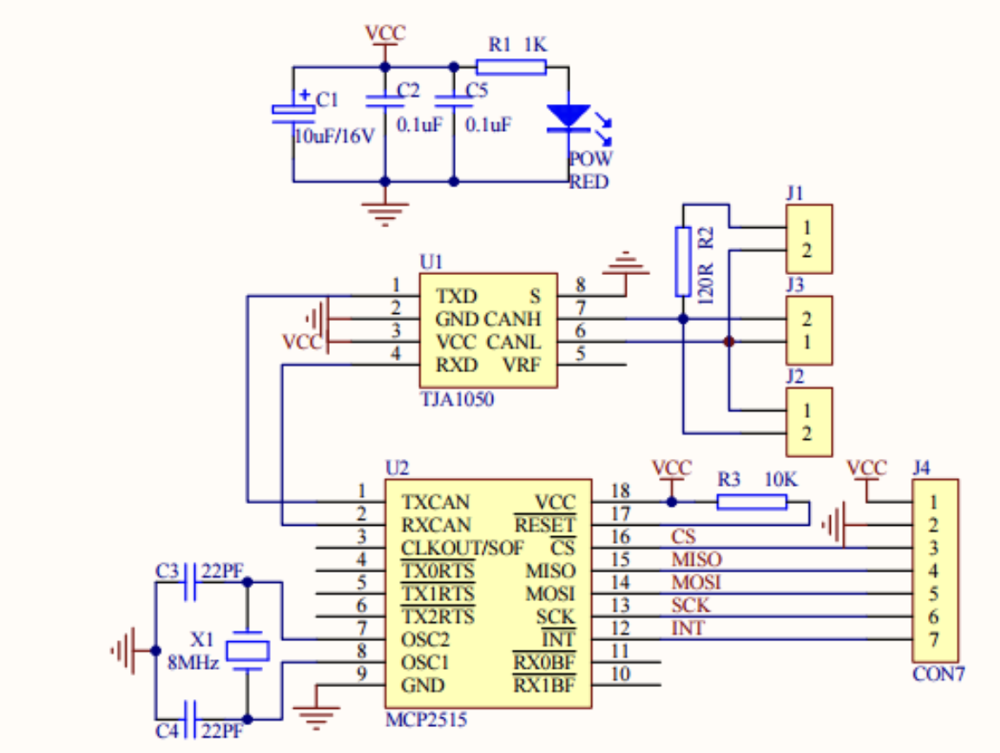

# RS485 CANHAT Interfacing with Arduino to Acess Battery Charge Information

- This Project is a solution to solve the interfacing RS485 CANHAT (used [RS485 CANHAT from Waveshare](https://www.waveshare.com/rs485-can-hat.htm) as reference) and Arduino due to frequency mismatch. 

- I use an Arduino-compatible module [MCP2515 CAN Module TJA1050 Receiver SPI 51 Single Chip Program Routine Arduino](https://robu.in/product/mcp2515-can-module-tja1050-receiver-spi-51-single-chip-program-routine-arduino/?gad_source=1&gclid=Cj0KCQiAsaS7BhDPARIsAAX5cSCodMTumVW66Wz2qvzYIydVJiuprp_vA4tSuAzYT87YtuYtevEOqtQaAkcpEALw_wcB) to monitor and log battery charge information transmitted over our RS485 CANHAT.



Microchip's MCP2515 is Stand-Alone CAN Controller With SPI™ Interface, containing 2 receive buffers with prioritized message storage and 3 transmit buffers with prioritizaton and abort features. 

Hence Philips' TJA1050 is High speed CAN transceiver with atleast 110 connection support [it's datasheet](https://robu.in/wp-content/uploads/2017/09/TJA1050.pdf)

---

## Features
- Configuration of 500 kbps communication speed.
- Interrupt-driven mechanism for CAN message reception.
- Receives and scales raw battery charge information from CAN message.
- Logs raw CAN message data and scaled battery charge info (in %)

---

## Installation
1. Install the MCP_CAN library in your Arduino IDE:
   - Download the CAN BUS Shield Compatible library: [CAN.zip](CAN.zip)
   - Go to **Sketch > Include Library > Add .ZIP Library**.
   - Search for path where the file is downloaded and install it.

2. Connecting CAN-BUS Shield Arduino:

   | **MCP2515 CAN Module Pin**     | **Arduino Pin**                       |
   |--------------------------------|---------------------------------------|
   | VCC                            | 5V                                    |
   | GND                            | GND                                   |
   | CS                             | Pin 10                                |
   | SCK                            | Pin 13                                |
   | MOSI                           | Pin 11                                |
   | MISO                           | Pin 12                                |
   | INT                            | Pin 2                                 |

3. Upload the code to Arduino.

## Code Outline
1. **Interrupt Handling**:
   - The function `MCP2515_ISR` sets a flag when a CAN message is received.
   - The main loop checks this flag to process the message.

2. **CAN Message Parsing**:
   - The function `CAN.readMsgBuf` reads the received CAN message into a buffer.
   - The CAN ID is fetched using `CAN.getCanId()`.

3. **Battery Charge Processing**:
   - If the CAN ID matches an id for example `0x100`, the code interprets the first two bytes of the message as the battery charge value. 
   - **Byte 0**: Lower byte of the battery charge value.
   - **Byte 1**: Higher byte of the battery charge value.
   - The charge is scaled by `100.0` to convert it to a percentage.
  
---

## Example Output of Receiving a CAN message from the battery charge sender.
```plaintext
- CAN_BUS GET DATA -
CAN ID: 0x100
Data Length: 2
Data: C8 00 
Battery Charge: 2.00 %
```

---

## License
This project is open-source and free to use [MIT License](LICENSE).

---